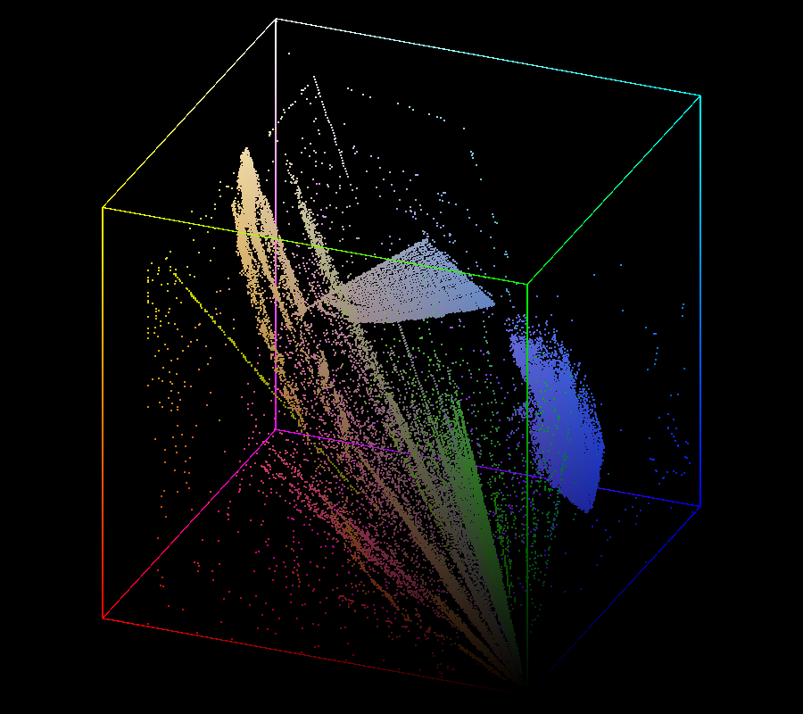
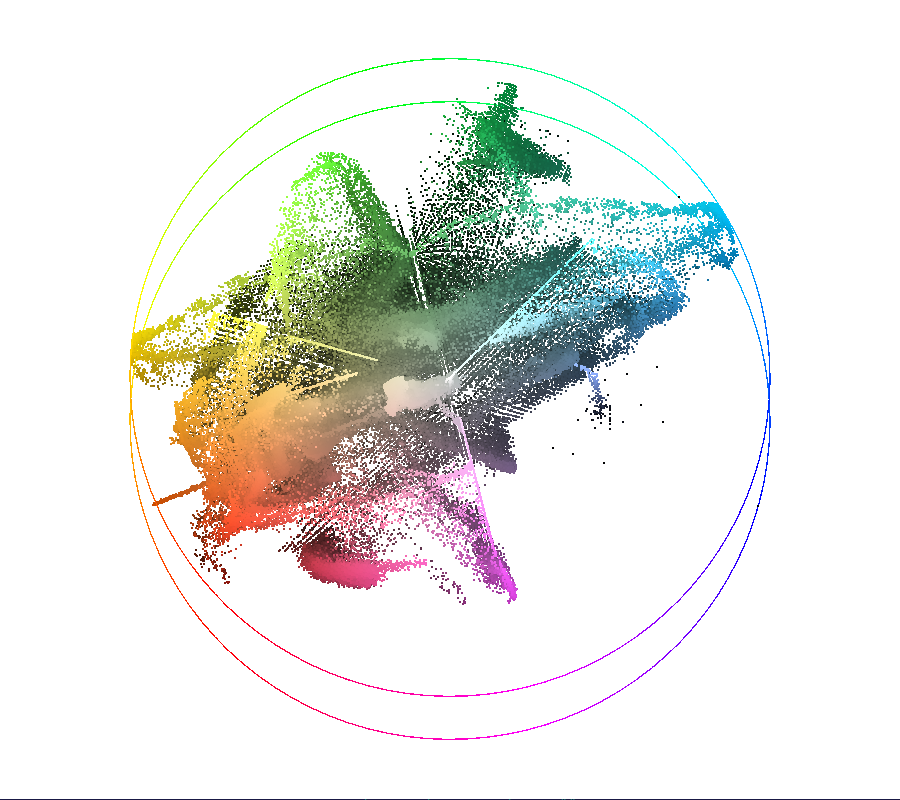

# ColorCube

3D Color histogram visualizer.

## Usage

Launch from command line by specifying a file to visualize:

`ColorCube.exe <path to image>`

## Controls

- **Hold LMB & drag** - move view angle
- **Right click** - switch background color
- **F1** - display as RGB cube
- **F2** - display as HSV cylinder

## Screenshots

Black background, RGB cube

White background, HSV cylinder

